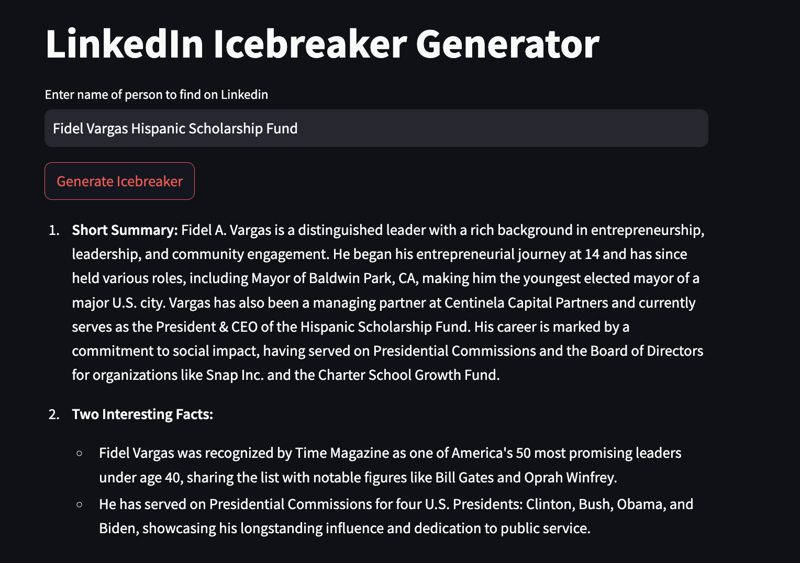
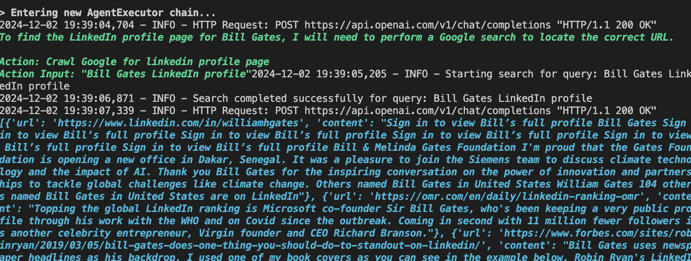
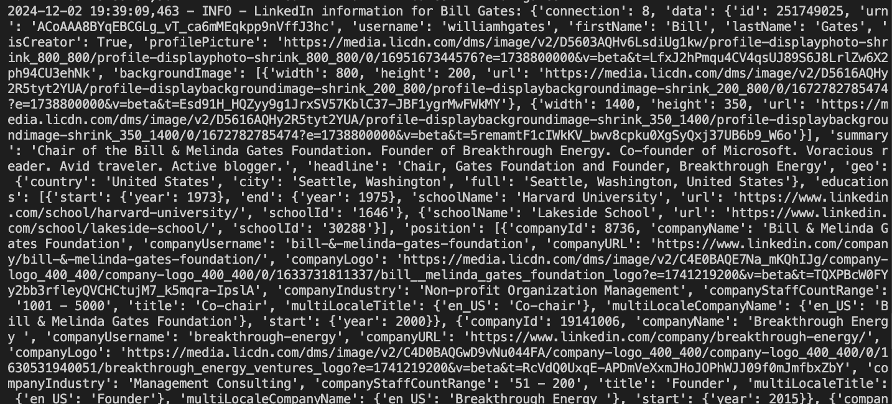

# LinkedIn Icebreaker Generator with LangChain Agents

Welcome to **IcebreakerBot**, a powerful LinkedIn networking tool that automatically generates personalized icebreakers for professionals using advanced AI agents. Built using state-of-the-art natural language models and cloud infrastructure, this project showcases cutting-edge technology and the ability to deliver real-world applications in AI-driven networking solutions.



---

## 🚩 Problems Solved

In the professional networking landscape, making meaningful connections can be challenging. Common issues include:

- **Lack of Personalization:** Generic messages often fail to make a lasting impression.
- **Time-Consuming Outreach:** Crafting individualized icebreakers for numerous contacts is inefficient.
- **Low Engagement Rates:** Without creative conversation starters, initiating conversations can lead to low response rates.
- **Identifying Relevant Profiles:** Finding the right LinkedIn profiles that match specific criteria can be daunting.

**IcebreakerBot** addresses these challenges by automating the creation of personalized icebreakers, saving time, enhancing engagement, and streamlining the networking process.

## 🎯 Potential Use Cases

### 📈 Marketing

- **Lead Generation:** Automatically generate personalized messages to initiate conversations with potential leads.
- **Campaign Outreach:** Enhance email and LinkedIn outreach campaigns with customized icebreakers to increase response rates.
- **Customer Engagement:** Foster stronger relationships with existing customers through tailored communication.

### 🤝 Business-to-Business (B2B) Sales

- **Prospect Outreach:** Quickly create personalized introductions to reach out to potential business partners or clients.
- **Networking Events:** Prepare customized icebreakers for attendees to facilitate meaningful interactions at events.
- **Account Management:** Improve client relations by initiating conversations with personalized messages based on client profiles.

## 🚀 Key Technologies & Features

### 1. **LangChain Agents**

- **Dynamic Profile Search:** Utilizes **LangChain** agents to dynamically search for LinkedIn profiles based on user input and retrieve personalized information.
- **Advanced AI Integration:** Leverages **GPT-4** through **OpenAI** and models like **Llama** to process and understand LinkedIn profiles, generating creative, human-like conversation starters.

### 2. **NLP & Large Language Models (LLMs)**

- **Intelligent Content Generation:** Employs **Large Language Models (LLMs)**, including **GPT-4** and **Llama**, to create personalized and contextually relevant icebreakers.
- **Natural Language Understanding:** Ensures the generated messages are coherent, engaging, and tailored to the recipient's profile.

### 3. **API Integration**




- **RapidAPI:** Facilitates real-time LinkedIn data scraping, automating the process of fetching up-to-date profile information.
- **Tavily Search Results:** Crawls Google to pinpoint accurate LinkedIn profiles, enhancing the robustness of profile identification.
- **LinkedIn API Integration:** Connects seamlessly with LinkedIn APIs to retrieve and utilize profile data effectively.

### 4. **Streamlit Frontend**


- **Interactive Web App:** Built using **Streamlit**, providing a sleek and user-friendly interface for inputting names and generating icebreakers.
- **Real-Time Generation:** Instantly produces personalized messages upon user request, enhancing user experience.
- **Scalability:** Designed for easy extension, allowing future integration with additional social networks or professional platforms.

---

## 🔧 Installation

1. **Clone the Repository:**
   ```bash
   git clone https://github.com/espin086/IcebreakerBot.git
   cd icebreakerbot
   ```

2. **Install Dependencies:**
   Ensure you have Python installed. Then run:
   ```bash
   pip install -r requirements.txt
   ```

3. **Set Up Environment Variables:**
   Create a `.env` file in the root directory and add your API keys:
   ```env
   OPENAI_API_KEY=your_openai_api_key
   RAPID_API_KEY=your_rapidapi_key
   ```

4. **Run the Application:**
   ```bash
   streamlit run app.py
   ```

## 📄 License

This project is licensed under the Apache License, Version 2.0. See the [LICENSE](LICENSE) file for details.

---